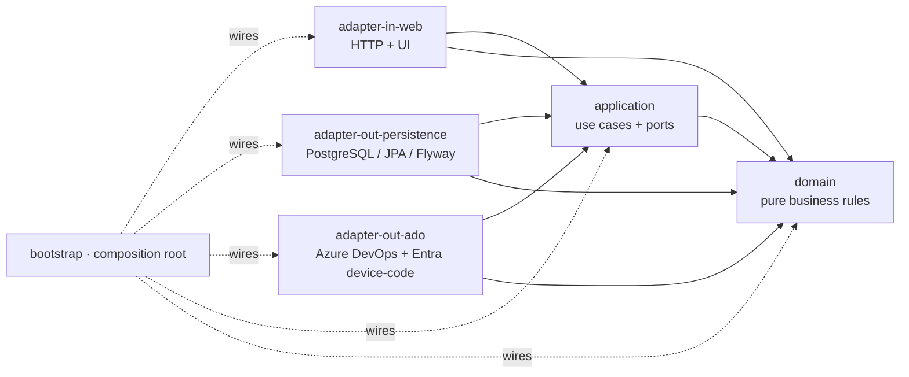

<div align="center">

# eng-performance

**Engineering-performance platform for Azure DevOps — DORA, Flow & AI metrics, navigable by team structure and frequency, with coaching-safe individual insight.**

[](https://openjdk.org/projects/jdk/21/)
[](https://spring.io/projects/spring-boot)
[](https://gradle.org/)
[](https://www.postgresql.org/)
[](https://azure.microsoft.com/products/devops)

[](#-architecture)
[](#-architecture)
[](#-quality-gates--the-harness)
[](#-quality-gates--the-harness)
[](https://github.com/google/google-java-format)
[-9cf)](#-spec-driven-development)
[](#-roadmap)

</div>

---

## ✨ What it is

`eng-performance` measures how engineering teams work by reading raw activity from **Azure DevOps**
(Repos/PRs, Pipelines, Boards) and turning it into three families of metrics — **DORA**, **Flow**
and **AI adoption** — sliced by **frequency** (daily/weekly/monthly) and by **org structure**
(vertical → team → person), always with **period-over-period evolution** and industry benchmarks.

A core product decision runs through the whole platform: **measure to improve the system, not to
surveil people.** There is no public leaderboard and no cross-team person comparison — the only
individual view is a manager coaching their **own** reports.

The **[PRD](docs/initial-spec.md)** is the source of truth for *what* is measured; the
**[navigable prototype](prototype/)** is the visual spec the UI reuses pixel-for-pixel.

## 🚀 Features

| Area | What you get | Endpoint |
|---|---|---|
| **Login & RBAC** | JWT auth, per-persona access scope; 403 outside scope; individual views are coaching-only | `POST /api/auth/login` · `GET /api/auth/me` |
| **Metrics engine** | On-read aggregation: sum / median / ratio / snapshot, hierarchy roll-up, as-of-event attribution, coverage, correct-polarity evolution | `GET /api/metrics/{catalog,cards,{key}/series}` |
| **DORA dashboard** | Deployment Frequency, Lead Time, Change Failure Rate, MTTR + benchmark tiers + coaching-safe rankings | `GET /api/dashboards/dora` |
| **Flow dashboard** | Cycle Time (4 phases), Throughput, WIP, PR Review Time, PR Size, Flow Efficiency + throughput×cycle scatter | `GET /api/dashboards/flow` |
| **AI dashboard** | % AI-assisted commits, dev adoption (distinct-count ratio), AI impact (cycle time with vs without AI) | `GET /api/dashboards/ai` |
| **Comparison heatmap** | Node-aware matrix of children × every metric, relative shading; people rows only for their manager | `GET /api/comparison/heatmap` |
| **Individual panel** | Commit calendar, PR assertiveness, delivery trends, code-review contribution, work-type distribution, ADO deep-links | `GET /api/individuals/{node}` |
| **Admin** | Users, org structure, committer identities, repositories, AI convention | `…/api/admin/*` |
| **Azure DevOps sync** | **Interactive device-code login (no PAT)** → backfill + incremental watermark, all behind the store port | `POST /api/admin/ado/sync` |

> The frontend is a self-contained, server-rendered SPA (vanilla JS + the prototype's own design
> system) — every screen reads the real engine; numbers reflect the data, not a mock.

## 🏛 Architecture

**Hexagonal (ports & adapters)** — dependencies only point **inward**, and the rule is enforced at
build time by **ArchUnit** (a violation fails the build, so the architecture can't silently erode).



| Module | Responsibility | May depend on |
|---|---|---|
| `domain` | Pure business rules — **no framework, no Spring** | — |
| `application` | Use cases + inbound/outbound ports — **no Spring** | `domain` |
| `adapter-in-web` | HTTP API + served UI (inbound) | `application`, `domain` |
| `adapter-out-persistence` | Outbound ports over **PostgreSQL** (JPA + Flyway) | `application`, `domain` |
| `adapter-out-ado` | The real **Azure DevOps** source (device-code auth + REST) — the *only* module that speaks HTTP | `application`, `domain` |
| `bootstrap` | Executable app; composition root wiring ports → adapters | all |
| `architecture-tests` | ArchUnit rules guarding the boundaries | all (test) |

**The metrics engine** is the heart: events are stored **raw** (each commit, PR, deploy, work item,
review with timestamps) and **aggregated on read** along any dimension × frequency × statistic.
Team numbers are recomputed over the population (never averages of averages), attribution is
**as-of-event** (a period's numbers stay with the team of record even after someone moves), and
coverage tracks attributed vs unattributed events. The Azure DevOps adapter (S9) only swaps the
*source* of those raw events — the **same** `raw_event` table the platform has read since day one.

## 🧰 Tech stack

- **Java 21**, **Spring Boot 3.4**, **Gradle** (Kotlin DSL) multi-module build.
- **PostgreSQL 16** via **JPA + Flyway** migrations; **Testcontainers** for integration tests.
- **Stateless JWT** auth; **Microsoft Entra device-code** for interactive ADO ingestion (no PAT).
- **Thymeleaf**-served, self-contained UI reusing the prototype's design system — plain CSS +
  vanilla JS, no runtime CDN.

## 🛡 Quality gates — the harness

Everything below runs inside **`./gradlew build`** and must be green:

- **Spotless** (google-java-format) — formatting is the single source of truth.
- **Checkstyle** — curated structural/style rules (`config/checkstyle`).
- **SpotBugs + FindSecBugs** — static & security analysis (`config/spotbugs`).
- **JaCoCo** — coverage everywhere; **70% line + 60% branch floor** enforced on `domain` + `application`.
- **ArchUnit** — hexagonal boundaries + "only `adapter-out-ado` may talk HTTP".

The UI is inline vanilla JS + CSS (no build step, no bundler). Supply-chain scanning (dependency
CVEs, secrets) is intentionally out of scope for this harness; SpotBugs+FindSecBugs covers static
security of the code itself.

## ⚡ Getting started

**Prerequisites:** JDK 21 and Docker (for PostgreSQL + Testcontainers).

```bash
# 1. Start PostgreSQL (data persists in a Docker volume)
docker compose up -d db

# 2. Build with all gates (Testcontainers spins up its own Postgres for the DB tests)
./gradlew build

# 3. Run the app → http://localhost:8080
./gradlew :bootstrap:bootRun
```

On first start a deterministic, idempotent seeder fills `raw_event` with ~6 months of fixtures so
every dashboard has data. Connect a real Azure DevOps org in **Admin → Integração ADO** and the
seeder stands down — the interactive sync fills the same table instead.

### 🐳 One command to run everything (Docker)

Prefer not to install a JDK toolchain locally? One script builds the app, packages it as a Docker
image, and brings up **PostgreSQL + the app** together via docker compose. Only **Docker** (Docker
Desktop on macOS/Windows) and a **JDK 21** on the `PATH` are needed.

**Linux / macOS**

```bash
./scripts/run-local.sh          # build image + start db & app → http://localhost:8080
./scripts/run-local.sh --logs   # follow the app logs
./scripts/run-local.sh --down   # stop & remove the containers (the DB volume is kept)
```

**Windows (PowerShell)**

```powershell
.\scripts\run-local.ps1         # build image + start db & app → http://localhost:8080
.\scripts\run-local.ps1 logs    # follow the app logs
.\scripts\run-local.ps1 down    # stop & remove the containers (the DB volume is kept)
```

Under the hood: `gradlew :bootstrap:bootJar` builds the Spring Boot fat jar → a thin
[`Dockerfile`](Dockerfile) packages it as `eng-performance:local` → `docker compose --profile full`
starts the `db` and `app` services (the `full` profile keeps `docker compose up -d db` db-only for
the Gradle workflow). The app reaches Postgres at `db:5432` inside the compose network.

**Handy commands**

```bash
./gradlew spotlessApply          # auto-format
./gradlew :bootstrap:bootRun     # run at http://localhost:8080
```

> This host's Docker daemon is very new (API floor 1.40); `scripts/fix-docker-min-api.sh` lowers it
> to 1.24 so Testcontainers can connect.

**Default logins** (seeded; password `prototipo`): `admin@empresa.com` (admin) ·
`paula@empresa.com` (exec) · `ana.souza@empresa.com` (manager) · `bruno.lima@empresa.com` (contributor).

## 🗂 Project layout

The Gradle modules are grouped by hexagon layer on disk; their logical names stay flat
(`:domain`, `:adapter-in-web`, …), so dependencies are unaffected.

```
core/          domain · application            # inner layers (no framework)
adapters/      in-web · out-persistence · out-ado
app/           bootstrap                        # executable / composition root
test/          architecture-tests              # ArchUnit boundary rules
docs/          initial-spec.md · api/openapi.yaml · …   # product PRD + API contract
prototype/     the navigable UX prototype = the visual spec
openspec/      spec-driven change history (proposals, specs, archive)
config/        checkstyle + spotbugs configuration
hooks/         version-controlled git hooks
scripts/       dev helpers (run-local, docker API floor, ADO auth test)
```

## 🧭 Spec-driven development

Behavior changes go through **[OpenSpec](openspec/)** — never hand-edit `openspec/specs/`:

1. `/opsx:propose "<idea>"` → creates a change with `proposal.md`, `design.md`, `tasks.md`.
2. `/opsx:apply` → implements the tasks (the last task is a green build).
3. `/opsx:archive` → archives the change and promotes the deltas into `openspec/specs/`.

`openspec validate` checks changes/specs; the living per-capability truth lives in `openspec/specs/`.

## 🤝 Contributing

1. **Branch** off `master` — never commit to it directly.
2. **Enable the git hooks** once per clone:
   ```bash
   git config core.hooksPath hooks && chmod +x hooks/*
   ```
   `pre-commit` runs format + Checkstyle (fast); `pre-push` runs the full `./gradlew build`.
3. **Respect the boundaries** — dependencies point inward; `domain`/`application` stay framework-free.
   ArchUnit will fail the build otherwise.
4. **Keep the gates green** — never disable a rule, suppress a warning, or lower the coverage floor to
   get a build through. Fix the cause.
5. **Match the surrounding code** — comment density, naming, idioms. Run `./gradlew spotlessApply`.
6. **Behavior changes** go through the OpenSpec flow above.
7. **Commits** — short imperative one-liners; **run `./gradlew build` before pushing.**

## 🗺 Roadmap

Built as **vertical slices**, each crossing every hexagonal layer and shipping its own screen
([`openspec/roadmap.md`](openspec/roadmap.md)):

- **S1–S3** — org structure & registry · accounts, login & RBAC · metrics engine + navigation shell ✅
- **S4–S6** — DORA group · Flow group · AI group (each: metrics + composed dashboard + screen) ✅
- **S7–S8** — cross-cutting Comparison heatmap · individual contribution panel ✅
- **S9** — real Azure DevOps adapter (interactive device-code ingestion, no PAT) ✅

The walking skeleton is complete end-to-end. Live ADO sync against a real org (backfill + identity
mapping) is the operator's acceptance step.

## 📄 License

No license file yet — all rights reserved by the author until one is added. Open an issue if you'd
like to use or contribute to this project.
